# The Invisible Pastrami Group
<h3> We call our creation "Req.Body"</h3>

### Overview
A Node, Express, and MySQL website application designed to help build fitness and health routines.

Please try out the deployed app in Heroku, found (PENDING) [here](PENDING).

<h3>Images below for easy viewing</h3>
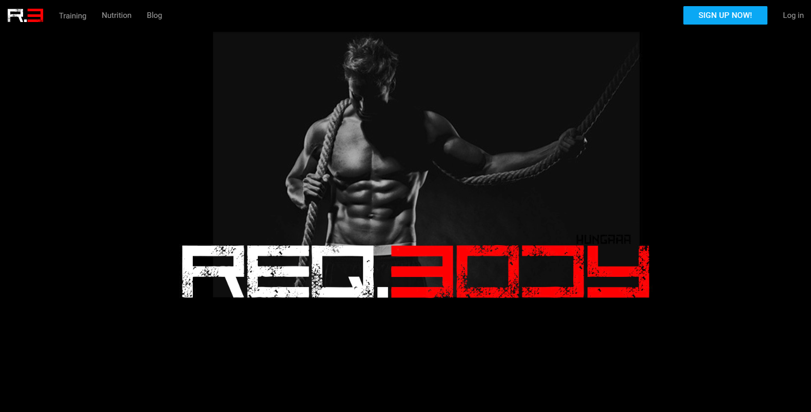
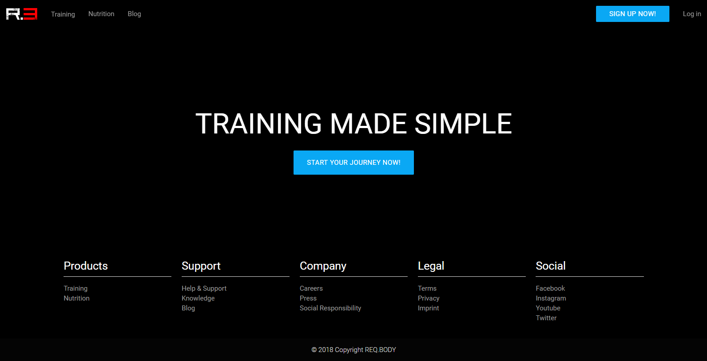
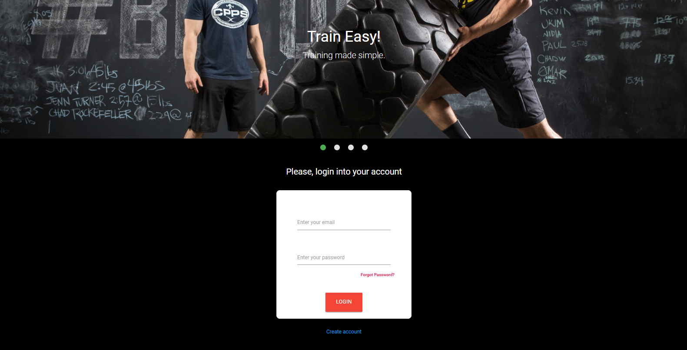
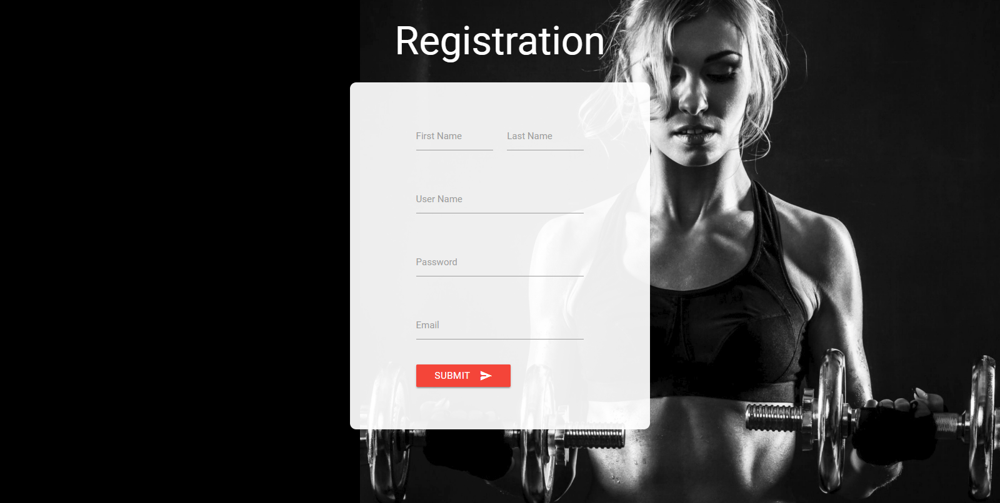
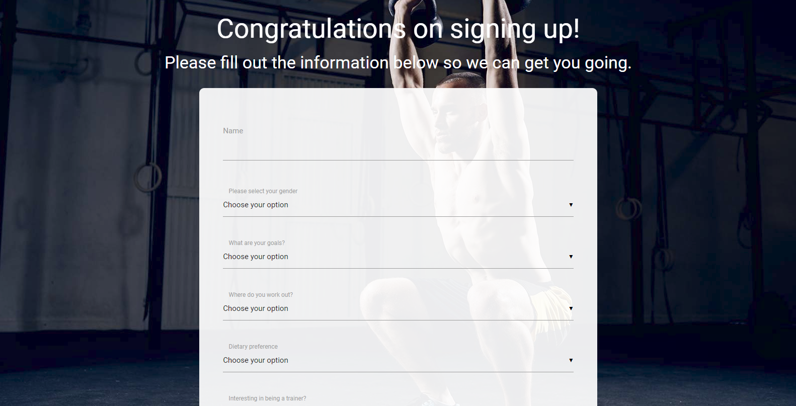
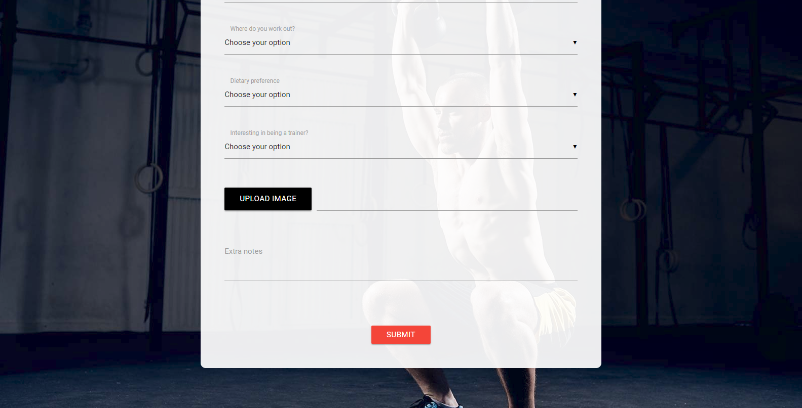
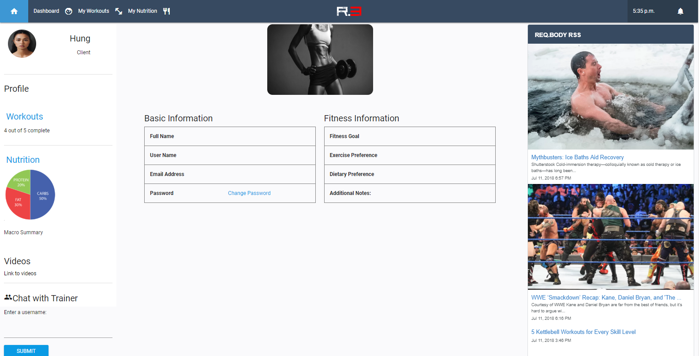
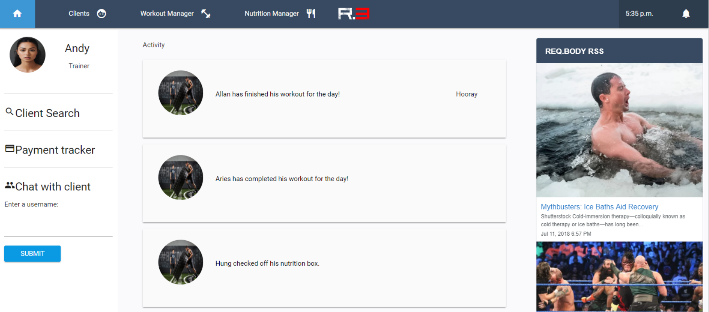
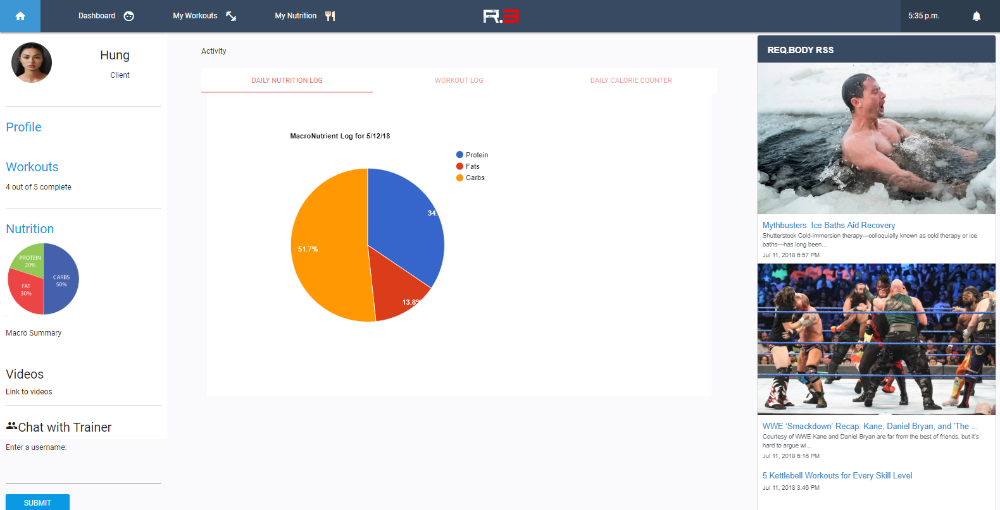
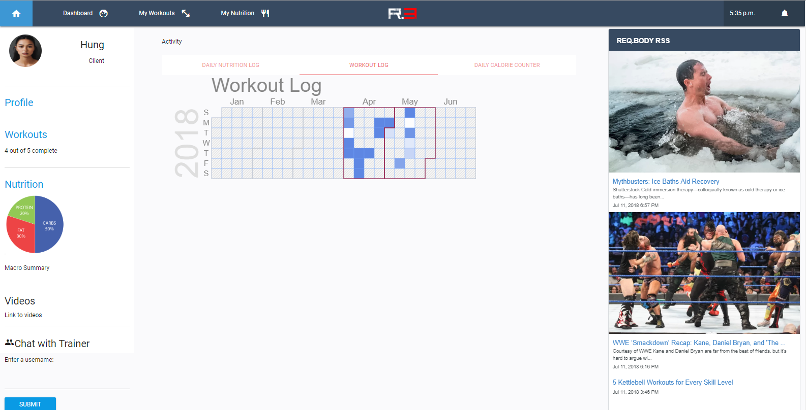
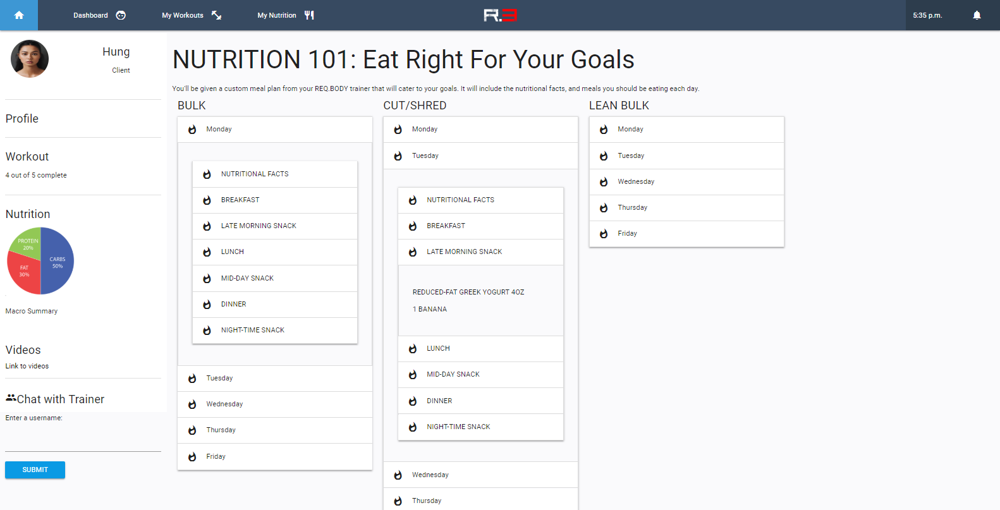
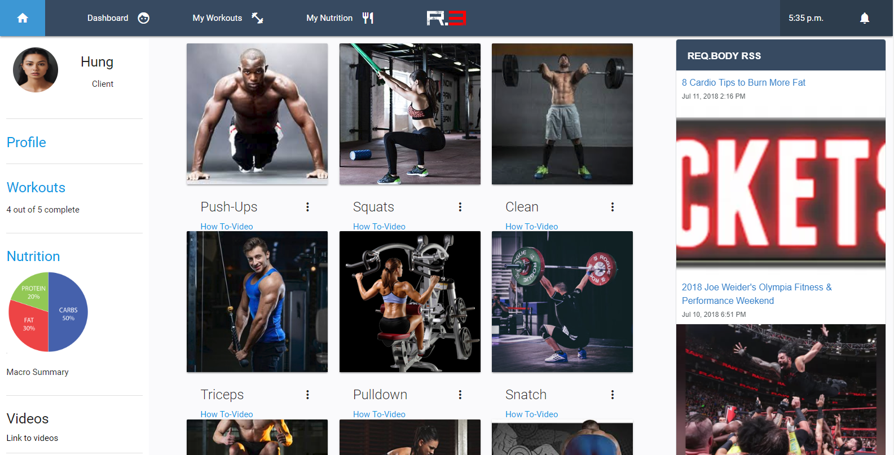
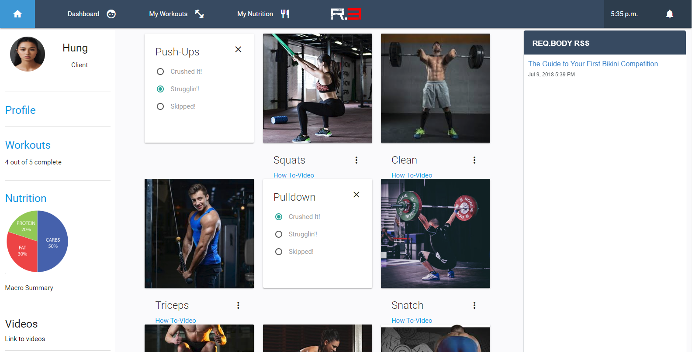
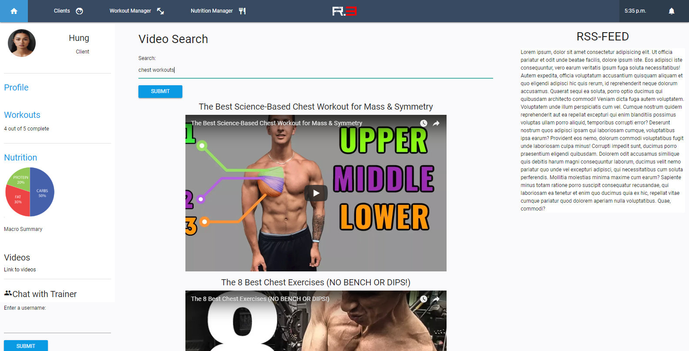
